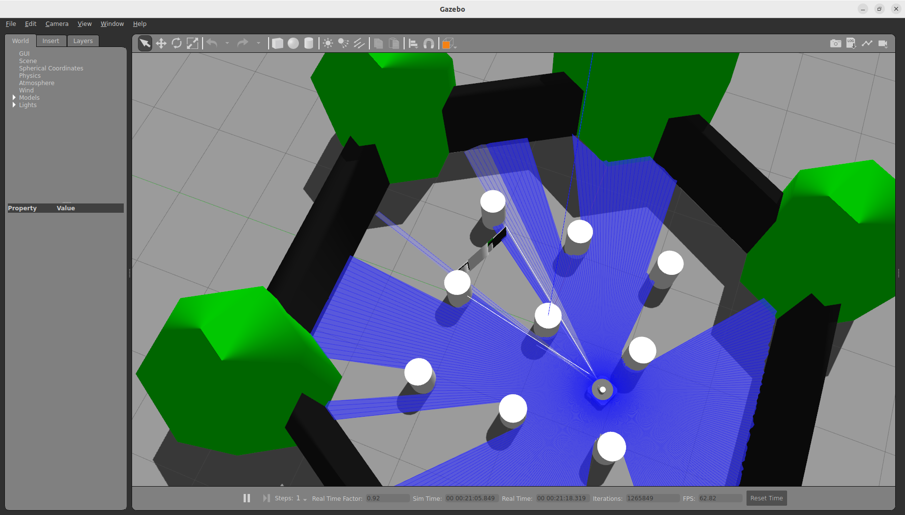
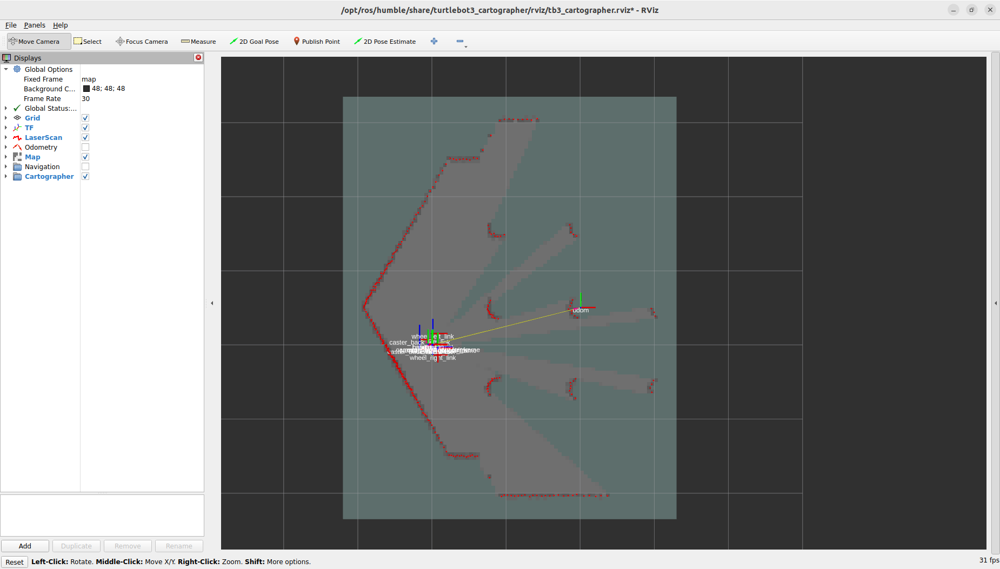
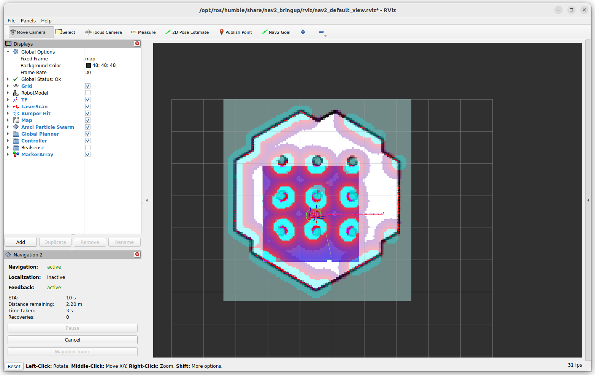

### Runtime Environment

● Ubuntu 22.04.5 LTS
● ROS2 Humble
[ROS2 Humble install link](https://docs.ros.org/en/humble/Installation/Ubuntu-Install-Debs.html)

### How to build?
1. Install dependencies
```bash
$ sudo apt update
$ sudo apt install ros-humble-gazebo-*

$ sudo apt install ros-humble-cartographer
$ sudo apt install ros-humble-cartographer-ros

$ sudo apt install ros-humble-navigation2
$ sudo apt install ros-humble-nav2-bringup

$ sudo apt install ros-humble-dynamixel-sdk
$ sudo apt install ros-humble-turtlebot3-msgs
$ sudo apt install ros-humble-turtlebot3
```

2. Create the workspace  
```bash
$ mkdir -p ~/turtlebot3_ws/src
$ cd ~/turtlebot3_ws/src
$ git clone -b humble-devel https://github.com/DavyJoker/turtlebot3_simulation.git
```

3. Build
```bash
$ cd ~/turtlebot3_ws && colcon build --symlink-install

Starting >>> turtlebot3_fake_node
Starting >>> turtlebot3_gazebo
Finished <<< turtlebot3_fake_node [0.09s]
Finished <<< turtlebot3_gazebo [11.3s]
Starting >>> turtlebot3_simulations
Finished <<< turtlebot3_simulations [0.08s]

Summary: 3 packages finished [11.5s]

```

4. Sourcing the environment 
```bash
$ echo "source /usr/share/gazebo-11/setup.bash" >> ~/.bashrc #if this step is not done, it may cause errors in the future
$ echo "source /opt/ros/humble/setup.bash" >> ~/.bashrc
$ echo "source $HOME/turtlebot3_ws/install/setup.bash" >> ~/.bashrc
$ echo "export TURTLEBOT3_MODEL=waffle" >> ~/.bashrc
```

### How to run?
1. Run Gazebo
```bash
$ ros2 launch turtlebot3_gazebo turtlebot3_world.launch.py
```


2. Run SLAM
```bash
$ ros2 launch turtlebot3_cartographer cartographer.launch.py use_sim_time:=True
```
3. Create map
```bash
$ ros2 run turtlebot3_teleop teleop_keyboard
$ ros2 run nav2_map_server map_saver_cli -f ~/map
```


Make sure that map.pgm and map.yaml have been generated, and that map.pgm contains sufficient information to avoid an incomplete map.
4. Run navigation
Please close all the programs above.
4-1. 
```bash
$ ros2 launch turtlebot3_gazebo turtlebot3_world.launch.py
```
4-2.
```bash
$ ros2 launch turtlebot3_navigation2 navigation2.launch.py use_sim_time:=True map:=$HOME/map.yaml
```

4-3.
```bash
$ ros2 launch my_turtlebot3_navigation static_tf_and_goalpose.launch.py
```
